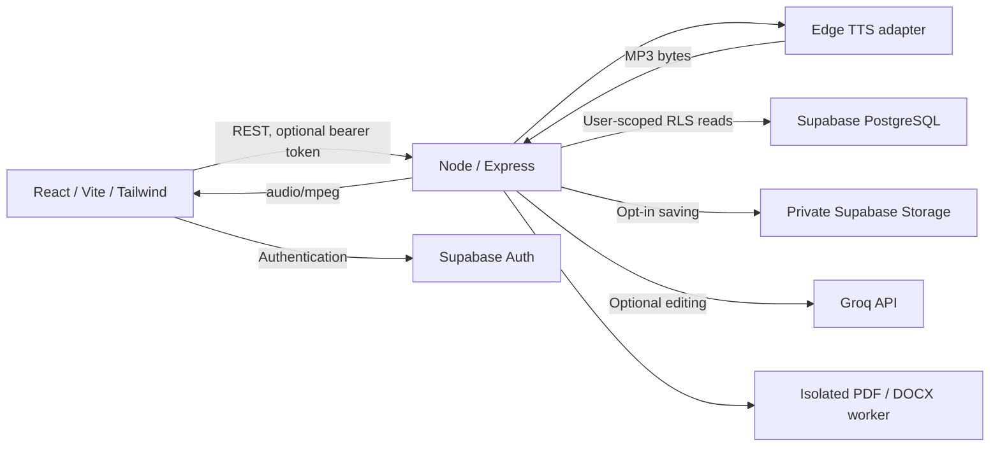

# LabMentix Voice — Text-to-Speech Application

A React and Express speech studio that turns editable text into downloadable MP3
audio through Edge TTS — a free, open-source text-to-speech service that requires
no API key, no account, and no sign-up. Optional Supabase accounts add private
speech history, favorites, and storage; optional Groq integration helps polish
text before speaking.

**Status:** source implementation includes Intermediate and Advanced features.
The app builds and runs immediately with no secrets required for speech. Supabase
and Groq features activate only when configured. No mock catalog, canned audio,
browser `speechSynthesis`, or fake analytics are used in the application.

## Problem and objectives

Written content is not always convenient to consume. This project makes it easy
to listen to notes, articles, and scripts, demonstrating React state, REST APIs,
server-side validation, secure third-party integration, authentication, PostgreSQL
ownership policies, and audio delivery in a college-project-sized application.

## Features

- Responsive studio with an editable text area, word/character counts, sample text,
  clear control, validation, and visible errors; maximum 5,000 UTF-16 code units.
- Live Edge Neural voice catalog (320+ voices), filtered language selection, multiple neural
  voices, voice metadata, and server-enforced language/voice/style compatibility.
- Speaking speed (0.5–2×), pitch (−50–50%), volume (0–100%), supported styles,
  settings reset, request loading state, and duplicate-generation prevention.
- MP3 generation, native play/pause/seek/time/volume controls, replay, and download.
- TXT import in the browser; PDF/DOCX extraction in isolated server workers. Both
  paths validate size/type and reject excessive text without silent truncation.
- Supabase registration, email confirmation, login, logout, persistent sessions,
  protected history, favorites, pagination, replay/download, and deletion.
- Opt-in saving to a **private** storage bucket; audio expires after 30 days when
  the included retention workflow is enabled. History text remains until deleted.
- Groq summarize, grammar correction, rewriting, and conversational rewriting,
  with an editable preview and explicit apply/discard controls.
- Admin-only real usage totals, popular voices/languages, daily counts, and recent
  activity. Only successfully logged signed-in generations appear in analytics.
- CORS allowlist, Helmet, JSON/type/schema validation, IP limits, authenticated
  PostgreSQL daily quotas, worker limits, timeouts, and safe error logging.

## Architecture



Guest audio is buffered only during the response and held in a browser object URL.
Authenticated saving uploads the MP3 and stores a history row before returning the
same audio. If saving fails, audio still returns with a visible warning.

## Technology stack and layout

- Client: React 19, TypeScript, Vite, Tailwind CSS 4, React Router, Phosphor icons.
- API: Node 24, Express 5, Zod, Helmet, express-rate-limit, multer.
- Extraction: PDF.js, Mammoth, yauzl; worker threads with resource limits.
- Data: Supabase PostgreSQL/Auth/Storage through an isolated database service.
- Tests: Node test runner + Supertest; Vitest + Testing Library.

```text
client/src/
  components/       editor, import, selectors, audio, AI preview, protected route
  contexts/         account session and configured capabilities
  hooks/            voice catalog and speech request lifecycle
  pages/            studio, authentication, history, admin
  services/         fetch boundary and public Supabase client
  utils/            text validation
server/
  app.js            HTTP middleware and route composition
  server.js         environment loading and server startup
  middleware/       verified authentication, guest quota, synthesis capacity
  routes/           accounts, files, AI
  services/         Azure, Supabase, Groq, document extraction
  utils/            validation and errors
  scripts/          retention cleanup
  tests/            API tests and real document fixtures
supabase/migrations/001_initial.sql
postman/TTS-API.postman_collection.json
docs/               API reference, development record, verification guide
.github/workflows/  CI and daily audio retention
vercel.json
render.yaml
```

## Installation and running locally

Use **Node.js 24.13 or newer** and npm. From the repository root:

```sh
npm ci
```

Copy `server/.env.example` to `server/.env` and `client/.env.example` to
`client/.env`. In PowerShell:

```powershell
Copy-Item server/.env.example server/.env
Copy-Item client/.env.example client/.env
```

Fill the values described below, then:

```sh
npm run dev
```

Frontend: `http://127.0.0.1:5173`; backend: `http://127.0.0.1:3001`.
The Vite proxy forwards `/api` to Express. These local development defaults are
not used as the deployed API URL. Restart Vite after changing client environment
variables; restart Express after changing its environment.

Run separately if preferred:

```sh
npm run dev --workspace server
npm run dev --workspace client
```

Build and verify:

```sh
npm run build
npm test
npm run check
```

## Environment variables

Never put Groq or Supabase service-role keys into a `VITE_` variable.

| Server variable             | Value to provide                                                  |
| --------------------------- | ----------------------------------------------------------------- |
| `PORT`                      | Local API port, default `3001`; Render supplies its own           |
| `NODE_ENV`                  | `development` locally; `production` on Render                     |
| `CLIENT_URL`                | Comma-separated exact frontend origins, without trailing slashes  |
| `TRUST_PROXY`               | `0` locally; `1` behind the documented single Render proxy        |
| `TTS_PROVIDER`              | `edge`                                                            |
| `SUPABASE_URL`              | Your project API URL                                              |
| `SUPABASE_ANON_KEY`         | Public anon/project publishable key compatible with your project  |
| `SUPABASE_SERVICE_ROLE_KEY` | Private server service-role key; never client-side                |
| `GROQ_API_KEY`              | Optional key from your Groq console                               |
| `GROQ_MODEL`                | Supported chat model; default `llama-3.3-70b-versatile`           |
| `RATE_LIMIT_MAX`            | API requests per minute per IP; default `20`                      |
| `DAILY_GENERATION_LIMIT`    | Generation attempts per day; default `50`                         |

| Client variable          | Value to provide                                                          |
| ------------------------ | ------------------------------------------------------------------------- |
| `VITE_API_BASE_URL`      | Empty locally for the proxy; deployed HTTPS backend origin without `/api` |
| `VITE_SUPABASE_URL`      | Same Supabase project URL; safe to expose                                 |
| `VITE_SUPABASE_ANON_KEY` | Public anon/publishable key; protected by RLS                             |

Edge TTS works out of the box with no API keys. Supabase and Groq credentials
are optional; enter them in ignored environment files or hosting secret settings.
Account navigation requires both client and server configuration.

## Edge TTS integration

Edge TTS uses Microsoft Edge's free "Read Aloud" text-to-speech service. **No API
key, no account, and no sign-up are required.** The adapter communicates over
WebSocket and works entirely server-side.

The API fetches 322 generally available neural voices and caches them for one
hour. English, Hindi, Marathi, Gujarati, Spanish, French, German, and many more
languages are available. The server never trusts a voice supplied solely by the
client.

Speech parameters (rate, pitch, volume) are converted to Edge TTS format
server-side. Output is MP3 audio. Network errors and invalid output produce 503
responses. The adapter is powered by the `@andresaya/edge-tts` npm package.

## Authentication, schema, and storage setup

1. Create a Supabase project and enable email/password authentication.
2. Run `supabase/migrations/001_initial.sql` once in its SQL editor. This creates
   profiles, history, favorites, usage logs, daily quota counters, RLS policies,
   server-only functions, and the private `speech-audio` bucket.
3. Add the project URL, public key, and service-role key to the server. Only the
   project URL and public key belong in the client environment.
4. Configure Auth Site URL and allowed redirect URLs for the local frontend and
   deployed frontend `/login` URL. Keep email confirmation enabled. Configure
   your own SMTP service if the built-in email limits prevent demonstrations.
5. Register and confirm a real account. Enable **Save to my history** before
   generating speech; saving is opt-in. Open History to replay, download, view
   text/settings, favorite, or delete a speech.

`profiles.id` references `auth.users`; history and usage rows reference profiles.
Favorites have a composite foreign key linking the user to their own speech.
History and favorites are indexed for user-scoped reads. Client roles cannot
promote themselves, insert fake history/usage, or edit quotas. Express verifies
bearer tokens with `auth.getUser`, then uses that user's token for RLS-protected
reads and deletes. Sensitive writes and quota reservations use the backend role.

To make an account an admin, run this from the trusted Supabase SQL editor,
substituting the intended account ID:

```sql
update public.profiles set role = 'admin' where id = 'YOUR_USER_UUID';
```

Sign in again to refresh admin navigation. The backend independently verifies the
database role on every analytics request. There is no public admin-registration
option. [Supabase token verification](https://supabase.com/docs/reference/javascript/auth-getuser)
and [private asset delivery](https://supabase.com/docs/guides/storage/serving/downloads).

## AI enhancement

Set the optional Groq key and model on the server. Authenticated users then see
four editing actions in the studio. Text is sent to Groq only after selecting an
action. The result appears in an editable preview; applying it is a separate step.
Requests are limited to 20 enhancements per hour per user on a single API instance.
Review generated text for factual changes before applying it.
[Groq API reference](https://console.groq.com/docs/api-reference).

## Security and retention

- Exact CORS allowlist, Helmet headers, no private keys in the frontend, no stack
  traces or text/token logging in API errors, and no raw user HTML rendering.
- Every TTS field is validated; unknown fields and incompatible settings fail.
  Control characters and lone UTF-16 surrogates are rejected while normal Unicode
  and emoji remain supported. User-provided text is escaped when constructing SSML.
- Guest audio never persists on the server. Browser object URLs are revoked when
  replaced, cleared, or unmounted. Saved audio URLs expire after five minutes.
- Maximum uploaded file size: 5 MB. DOCX is checked for excessive expansion,
  entries, and encryption. PDFs are limited to 50 pages. Workers have a 15-second
  deadline and memory limits; at most two imports and four syntheses run at once.
- Authenticated daily quotas reserve attempts atomically in PostgreSQL using UTC
  days. Failed provider attempts also consume quota. Guest limits are per-IP,
  use 24-hour windows, and reset when the API process restarts.
- Run `npm run cleanup --workspace server` daily. The included retention workflow
  needs GitHub Actions secrets `SUPABASE_URL`, `SUPABASE_ANON_KEY`, and
  `SUPABASE_SERVICE_ROLE_KEY`. Without the configured job, storage does not expire
  automatically. History deletion removes audio immediately.
  Set the repository Actions variable `ENABLE_AUDIO_RETENTION` to `true` after
  adding the secrets; the scheduled job is safely skipped until enabled.
- The same retention command removes old orphan MP3s, including failed database
  writes or files left by direct database/account deletion, from the dedicated
  speech bucket after 30 days.
- Use HTTPS in production. CORS is a browser boundary, not API authentication.
  Public generation remains subject to provider and IP limits.

## API and Postman testing

The full contract is in [docs/API.md](docs/API.md). Import
`postman/TTS-API.postman_collection.json` into Postman. Set `baseUrl` to the API
origin. Run Core first so the collection chooses a real available voice. Use a
3,200 ms runner delay to avoid the normal 20-request/minute limit.

Validation covers empty/long text, bad languages/voices, mismatches, malformed
JSON, incorrect Content-Type, and unauthenticated access. Protected folders need a
Supabase access token in the local `token` variable. AI needs both auth and Groq.
The Manual scenarios folder must run separately: it deliberately expects missing
provider credentials, rate-limit exhaustion, or an admin token. Do not export real
tokens. Regenerate the collection with `node postman/generate.mjs` after edits.

## Deployment: Vercel + Render

1. Push this repository to your own GitHub repository. No remote or public repo is
   created automatically, and no credentials are committed.
2. In Render, create a Blueprint from `render.yaml`, or a Node web service with
   root directory left at the repository root, build `npm ci --omit=dev`, and start
   `npm start --workspace server`. Health path: `/api/health`.
3. Fill Render environment variables from the table above. `CLIENT_URL` must be
   the exact deployed Vercel origin. Optional Supabase/Groq fields can be left
   empty for a basic TTS deployment. Use only HTTPS URLs in production.
4. In Vercel, import the repository with its **root directory at the repository
   root**. `vercel.json` supplies build/output settings and SPA route rewrites.
   Set `VITE_API_BASE_URL` to the Render HTTPS origin. Add the two public Supabase
   values if using accounts, then deploy.
5. Update Render's CORS origin and Supabase's Auth URLs to the actual frontend
   address. Redeploy when changing build-time `VITE_` variables.
6. Configure the retention workflow secrets and manually run it once. Enable
   scheduled workflows on the default branch. Monitor failures and storage usage.
7. Follow [docs/VERIFICATION.md](docs/VERIFICATION.md) against deployed URLs.

Vercel/Render URLs are assigned by the hosting accounts; **no public deployment has
been created**. Free Render web services sleep after inactivity, so allow for a
cold start and retry connection if necessary. Free hosting is for demonstrations,
not an uptime guarantee. [Render free services](https://render.com/docs/free),
[Vercel build configuration](https://vercel.com/docs/builds/configure-a-build).

## Free resource strategy

Edge TTS requires no account or API key and is free to use. Supabase Free, Groq's
available free allowance, Vercel Hobby, and Render Free are the intended starting
points for optional features, subject to account/region eligibility and current
terms. No paid plan is provisioned by this repository. The app maps provider
failures to a friendly error and keeps editing/import available.

The included GitHub Actions job can provide retention within your Actions quota;
a paid Render cron service is not necessary. Track storage and email usage on the
[Supabase pricing page](https://supabase.com/pricing). Do not assume any free tier
is unlimited or will remain unchanged.

## Screenshots and demonstration

The running studio was visually reviewed at desktop and 390-pixel mobile widths.
Open the app and use **Try sample text** for a screenshot-ready editor. Capture
the generated audio state, a second language, your own history, and the AI preview.
No screenshots with invented voices or analytics are included.

## Limitations and future improvements

- Supabase, Groq, RLS execution, and hosted URLs require account setup. Edge TTS
  works immediately with no credentials. Automated tests inject explicit test
  adapters; those do not ship as selectable providers.
- PDF import extracts existing text; OCR, scanned PDFs, complex reading-order
  recovery, and password-protected PDFs are not supported. DOCX imports plain text
  only. Files longer than the character limit are rejected intact.
- Edge TTS relies on Microsoft Edge's public Read Aloud service. The adapter
  rejects MP3 output at or above 3,480,000 bytes to avoid excessively long audio.
  Use shorter passages at slow speaking speeds. MP3 is the only output format.
- Browser native audio control presentation varies, especially on mobile, where
  device volume controls may replace the browser volume slider.
- Guest/global/AI rate limits are in memory for one instance. Use a shared rate
  limit store and a distributed queue before horizontal scaling. Database quotas
  are already atomic. Retention requires its scheduled workflow to be enabled.
- The favorites filter applies to the current history page; pagination remains
  explicit. Analytics describe logged signed-in usage, not anonymous activity.
- Storage and database deletion are not one cross-service transaction; download
  the MP3 if a saving warning appears. Cleanup failures require operational retry.
- Add further TTS adapters through `listVoices()` and `synthesize()`, chunked long
  speech with audio joining, OCR, password recovery, shared rate limits, and usage
  alerts as future extensions.
